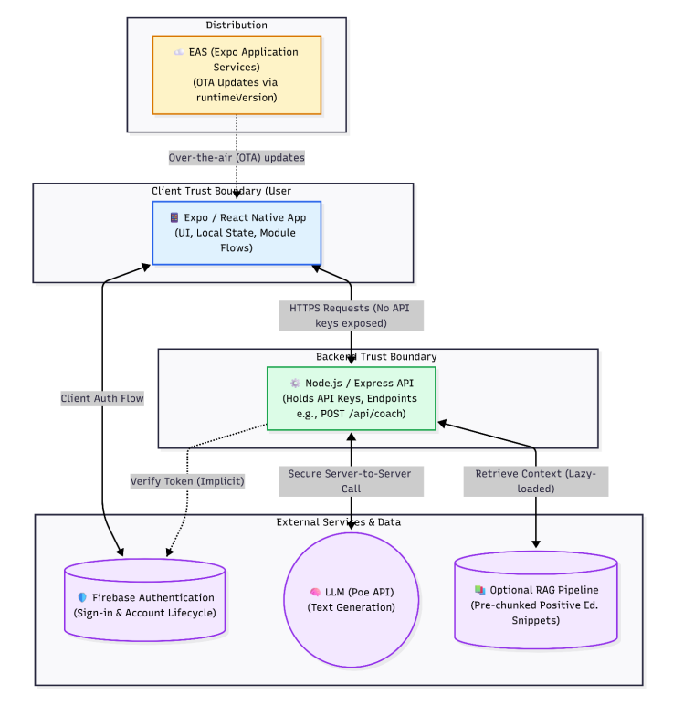

# PosiGlow (正發光) 🌱

> An AI-Assisted Positive Education Mobile Application for Secondary School Students in Hong Kong.

PosiGlow is a proactive, stigma-free mobile application built on the Geelong Grammar School (GGS) Positive Education model (**PERMA+H**). Designed specifically for Hong Kong secondary students, it transitions from a traditional, reactive medical model of care to a preventive, asset-based approach to mental well-being.

## ✨ Core Features

The application translates empirically validated Positive Psychology Interventions (PPIs) into four engaging digital micro-behaviors:

1. **AI Positive Mindset Coach (正向教練)** 🤖
   - A brief, strengths-aware coaching dialogue interface.
   - Grounded in Strengths-Based Interventions and Cognitive Reframing to enhance self-efficacy.
   - *PERMA+H Alignment: Meaning (M)*

2. **Flow Focus Timer (離線深潛)** ⏳
   - An offline-friendly focus session with an XP reward system for completed runs.
   - Based on Flow Theory and time-boxing techniques to reduce cognitive fatigue and digital distraction.
   - *PERMA+H Alignment: Engagement (E), Accomplishment (A)*

3. **Stress Shredder (紓壓碎紙)** 📱
   - Users write down a stressor, physically shake their phone to "shred" it, followed by a paced 4-7-8 breathing exercise.
   - Integrates Expressive Writing with Somatic Regulation to lower acute anxiety.
   - *PERMA+H Alignment: Positive Emotions (P), Health (H)*

4. **Gratitude / Kindness Relay (火炬傳暖)** 🤝
   - A module to compose and share gratitude-oriented messages and actions.
   - Derived from Gratitude Journaling and prosocial interventions to improve interpersonal connectedness.
   - *PERMA+H Alignment: Relationships (R)*

## 🏗️ System Architecture

PosiGlow utilizes a mobile-backend approach to ensure security, scalability, and seamless updates. 



## 💻 Tech Stack

**Frontend (Client)**
* **Framework:** React Native / Expo
* **State Management:** Local State / Context API
* **UI/UX:** Tailored for Traditional Chinese (zh-Hant) users with a gamified interface.

**Backend (Server)**
* **Environment:** Node.js with Express
* **Authentication:** Firebase Authentication
* **AI Integration:** LLM integration (Poe API) with a Retrieval-Augmented Generation (RAG) pipeline to inject pre-chunked Positive Education snippets and prevent hallucinations.

**Deployment & DevOps**
* **OTA Updates:** Expo Application Services (EAS) Update
* **Runtime:** Hermes (Android build optimization)

## 🚀 Getting Started (Local Development)

If you wish to run this project locally, follow these steps:

### Prerequisites
* Node.js installed
* Expo CLI installed (`npm install -g expo-cli`)
* Firebase account setup
* API Keys for the LLM backend

### Installation

1. **Clone the repository:**
   ```bash
   git clone https://github.com/ronaldyipit/positive-edu-app.git
   cd positive-edu-app

2. **Install dependencies:**
   ```bash
   npm install

3. **Environment Variables:**
   Create a .env file in the root directory and add your Firebase and API configurations:
   ```env
   EXPO_PUBLIC_FIREBASE_API_KEY=your_api_key
   EXPO_PUBLIC_BACKEND_URL=your_backend_url

4. **Run the app:**
   ```bash
   npx expo start

## 🛡️ Safety & Ethics

PosiGlow is designed for educational, non-clinical capacity building. It includes a Crisis Intervention Protocol: a sensitive keyword detection system that triggers a mandatory pop-up with local emergency hotlines (e.g., Samaritan Befrienders) and suspends standard AI replies if extreme emotional distress is detected.

## 👨‍💻 Author
YIP Tsun Sing
